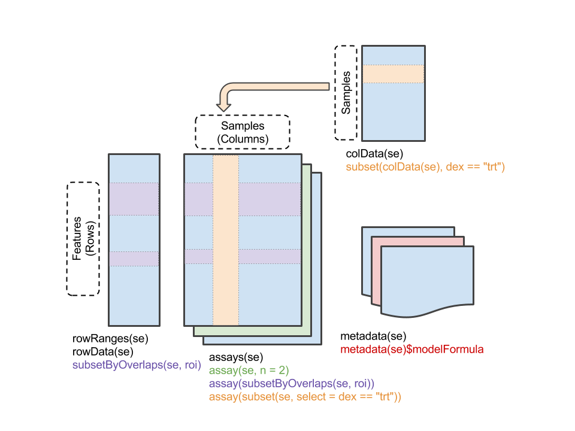
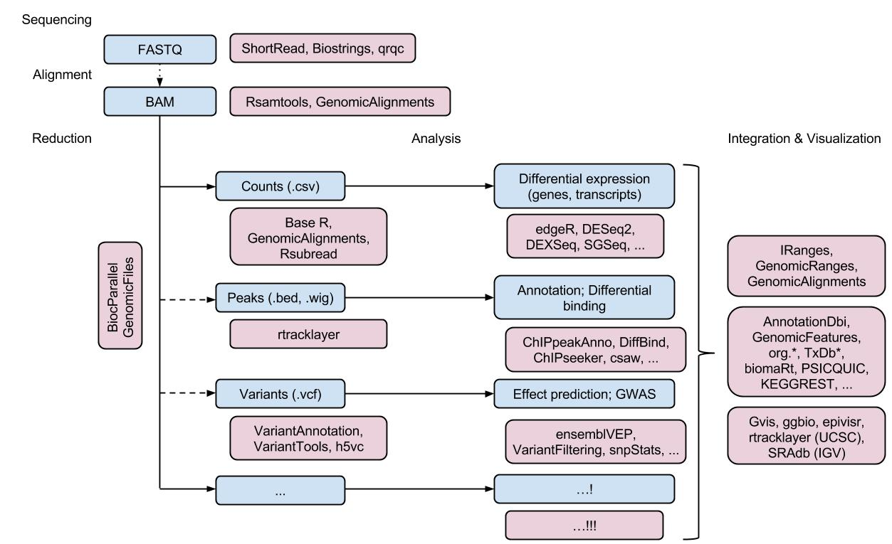

```{r setup, echo=FALSE}
knitr::opts_chunk$set(cache=TRUE, autodep=TRUE)
suppressPackageStartupMessages({
    library(ggplot2)
    library(Biostrings)
    library(GenomicRanges)
    library(SummarizedExperiment)

    library(DESeq2)
    library(VariantFiltering)

    library(TxDb.Hsapiens.UCSC.hg38.knownGene)
    library(TxDb.Hsapiens.UCSC.hg19.knownGene)
    library(BSgenome.Hsapiens.UCSC.hg38)
    library(BSgenome.Hsapiens.1000genomes.hs37d5)
    library(org.Hs.eg.db)
    
    library(airway)
    library(RNAseqData.HNRNPC.bam.chr14)
})
```

# Introduction to _R_ and _Bioconductor_

## Vectors, classes, methods, and packages

_R_

- Statistical
- Vectorized

    ```{r vector-to-class}
    x <- rnorm(100)
    y <- x + rnorm(100)
    ```

- Large data _per se_ is not a problem

    ```{r large-data}
    system.time(rnorm(1e7))
    ```

- Classes structure data (nouns)

    ```{r data.frame}
    df <- data.frame(X=x, Y=y)
    fit <- lm(Y ~ X, df)
    ```

- Methods transform objects (verbs)

    ```{r verbs}
    anova(fit)
    ```

- _R_ provides introspection

    ```{r introspection}
    class(df)
    dim(df)
    class(lm)
    methods(class=class(lm))
    ```

Packages

- Extend base functionality

    ```{r ggplot2}
    library(ggplot2)
    ggplot(df, aes(x=X, y=Y)) +
        geom_point() +
        stat_smooth(method="lm")
    ```

_Bioconductor_ -- key software and annotation resources

- [GenomicRanges][]

    ```{r granges}
    library(GenomicRanges)
    library(TxDb.Hsapiens.UCSC.hg38.knownGene)
    ex <- exons(TxDb.Hsapiens.UCSC.hg38.knownGene)
    ex
    keepStandardChromosomes(ex)
    hist(log10(width(ex)))
    ```

    ```{r grangeslist}
    introns <- intronsByTranscript(TxDb.Hsapiens.UCSC.hg38.knownGene,
        use.names=TRUE)
    hist(log10(lengths(introns)))
    introns[ which.max(lengths(introns)) ]
    ```

    ```{r genomicalignments}
    library(TxDb.Hsapiens.UCSC.hg19.knownGene)
    library(RNAseqData.HNRNPC.bam.chr14)

    library(GenomicAlignments)
    fname <- RNAseqData.HNRNPC.bam.chr14_BAMFILES[1]
    aln <- readGAlignments(fname)

    genes <- genes(TxDb.Hsapiens.UCSC.hg19.knownGene)
    chr14 <- genes[seqnames(genes) == "chr14"]

    hist(log10(1 + countOverlaps(chr14, aln)))
    ```

- [Biostrings][]

    ```{r}
    library(Biostrings)
    library(BSgenome.Hsapiens.UCSC.hg38)

    ex <- exons(TxDb.Hsapiens.UCSC.hg38.knownGene)
    ex <- keepStandardChromosomes(ex)
    dna <- getSeq(BSgenome.Hsapiens.UCSC.hg38, ex)
    dna
    gc <- letterFrequency(dna, "GC", as.prob=TRUE)
    head(gc)
    plot(density(gc))
    ```

- [SummarizedExperiment][]

    

    ```{r}
    library(SummarizedExperiment)
    library(airway)
    data(airway)
    airway

    head(assay(airway))
    colData(airway)
    rowRanges(airway)
    airway[, airway$dex == "trt"]
    ```

- The _Bioconductor_ sequencing ecosystem

    

[GenomicRanges]: https://bioconductor.org/packages/GenomicRanges
[Biostrings]: https://bioconductor.org/packages/Biostrings
[SummarizedExperiment]: https://bioconductor.org/packages/SummarizedExperiment

## Help!

`?`

- `?"findOverlaps<tab>"`
- `?GenomicRanges::findOverlaps`

biocViews and landing pages

Vigettes, workflows & training material

# RNA-seq

```{r setup-rna-seq, echo=FALSE}
colDataFile <-
    system.file(package="Brisbane2016", "extdata", "airway-colData.tab")
assayFile <- system.file(package="Brisbane2016", "extdata", "airway-assay.tab")
```

This part of the workshop uses data from a gene-level RNA-seq
experiment involving airway smooth muscle cells; details are provided
in the vignette accompanying the [airway][airway] package. The
original data is from Himes et al., "RNA-Seq Transcriptome Profiling
Identifies CRISPLD2 as a Glucocorticoid Responsive Gene that Modulates
Cytokine Function in Airway Smooth Muscle Cells." PLoS One. 2014 Jun
13;9(6):e99625.  PMID: [24926665][] GEO: [GSE52778][]. From the
Abstract: "Using RNA-Seq [...] we characterized transcriptomic changes
in four primary human ASM cell lines that were treated with
dexamethasone - a potent synthetic glucocorticoid (1 micromolar for 18
hours)."

We join the analysis after the sequencing, read aligment, and summary
of aligned reads to a table of counts of reads overlapping regions of
interest (genes) in each sample. We focus on a subset of the
experiment, with 4 cell lines each treated with dexamethasone or a
control.

More extensive work flows are available for use of
[DESeq2][DESeq2 workflow] and [edgeR / limma voom][].

[DESeq2 workflow]: http://bioconductor.org/help/workflows/rnaseqGene/
[edgeR / limma voom]: http://bioconductor.org/help/workflows/RNAseq123

[airway]: https://bioconductor.org/packages/airway
[24926665]: http://www.ncbi.nlm.nih.gov/pubmed/24926665
[GSE52778]: http://www.ncbi.nlm.nih.gov/geo/query/acc.cgi?acc=GSE52778

## Setup (not necessary during the workshop)

We'll use two packages from _Bioconductor_. These depend in turn on
several other packages. The packages and their dependencies are
already installed on the Amazon Machine Instance (AMI) used in the
course. For your own computers after the course, install packages with

```{r dependencies, eval=FALSE}
source("https://bioconductor.org/biocLite.R")
biocLite(c("DESeq2", "org.Hs.eg.db"))
```

Installation needs to be performed once per computer, not every time
the packages are used.

We use two data files in the analysis. The data files are in the
[Brisbane2016][1] github repository. Install the github repository with

```{r Brisbane2016, eval=FALSE}
biocLite("Bioconductor/Brisbane2016")
```

Once the package is installed, the location of the files (to be used
in `file.choose()`, below) is given by

```{r Brisbane2016-filepaths, eval=FALSE}
system.file(package="Brisbane2016", "extdata")
```

[1]: https://github.com/Bioconductor/Brisbane2016


## Sequence analysis work flows

Research question

- Designed experiment
- Gene-level differential expression
- RNA-seq data (http://bio.lundberg.gu.se/courses/vt13/rnaseq.html)

    

Data processing steps

- Quality assessment: FASTQ files; outside _R_
- Alignment and summary to count table
- Assessment of differential expression
- Results placed in context, e.g., gene set enrichment

Alignment & summary (traditional)

- Full alignment to BAM files, summarizing gene or transcript
  abundance, e.g., _Bowtie_ / _tophat_ / _cufflinks_; _RSEM_;
  [Rsubread][]
- Summarize to gene-level count tables or estimates of abundance
- _Counts_ are important: information about statistical uncertainty of
  estimate

Alignment & summary (contemporary)

- Approximate alignment directly to count tables of transcripts
  or genes, e.g.,[kallisto][], [salmon][]

[Rsubread]: https://bioconductor.org/packages/Rsubread
[kallisto]: https://pachterlab.github.io/kallisto/
[salmon]: http://salmon.readthedocs.io/en/latest/salmon.html

## Exploring count tables

We start with the 'phenotypic' data, describing the samples used in
the experiment. The data is a simple table of 8 rows and several
columns; it could be created in Excel and exported as a tab-delimited
file. Find the location of the file on your Amazon machine instance

```{r, eval=FALSE}
colDataFile <- file.chooose()    # find 'airway-colData.tab'
```

and read the data in to _R_ using the `read.table()` function. The
data is small enough to be viewed in the _R_ session by typing the
name of the variable) or in _RStudio_ (by using `View()` or
double-clicking on the variable in the 'Environment' tab).

```{r}
colData <- read.table(colDataFile)
colData

```

This should go smoothly; with real data one often needs to spend
considerable time adjusting arguments to `read.table()` to account for
the presence of a header, row names, comments, etc.

The next challenge is to input the expression estimates. This is a
matrix of rows representing regions of interest (genes) and columns
representing samples. Entries in the matrix are the number of reads
overlapping each region in each sample. It is important that the
values are raw counts, rather than scaled measures such as FPKM. Find
the file

```{r, eval=FALSE}
assayFile <- file.chooose()    # find 'airway-assay.tab'
```

Input the data and use `head()` to view the first few rows of the
data.

```{r}
assay <- read.table(assayFile)
head(assay)
```

**NOTE** Most modern work flows will start with data generated from
  [kallisto][], [salmon][], etc.; see the [tximport][] package and
  vignette for importing data from these software tools into _R_.

[tximport]: https://bioconductor.org/packages/tximport

Calculate the 'library size' (total number of mapped reads) of each
sample using `colSums()`

```{r}
colSums(assay)
```

Create a density plot of the average asinh-transformed (asinh is
log-like, except near zero) read counts of each gene using the
following series of commands.

```{r}
plot(density(rowMeans(asinh(assay))))
```

Multi-dimensional scaling (MDS) is a dimensionality reduction method
that takes vectors in n-space and projects them into two (or more)
dimensions. Use the `dist()` function to calculate the (Euclidean)
distance bewteen each sample, and the base _R_ function `cmdscale()`
to perform MDS on the distance matrix. We can use `plot()` to
visualize the results and see the approximate location of each of the
8 samples. Use the argument `col` to color the points based on cell
line (`colData$cell`) or experimental treatment `colData$dex`.

```{r}
d <- dist(t(asinh(assay)))
plot(cmdscale(d), pch=19, cex=2)
plot(cmdscale(d), pch=19, cex=2, col=colData$cell)
plot(cmdscale(d), pch=19, cex=2, col=colData$dex)
```

Note that cell lines are relatively similar to one another. This
suggests that cell line should be used as a covariate in subsequent
analysis.

## Differential expression

We will use the [DESeq2][] package for differential expression
analysis; other choices are possible, notably [edgeR][] and [limma][].

[DESeq2]: https://bioconductor.org/packages/DESeq2
[edgeR]: https://bioconductor.org/packages/edgeR
[limma]: https://bioconductor.org/packages/limma

The analysis starts by providing the expression count data, a
description of the experiment, and a 'model' that describes the
statistical relationship we'd like to estimate. For our model and
based in part on the exploratory analysis of the previous section, we
suppose that count is determined cell line and dexamethasone
treatment. We include cell line primarily as a covariate; our primary
interest is in dexamethasone.

```{r}
library(DESeq2)
dds <- DESeqDataSetFromMatrix(assay, colData, ~ cell + dex)
```

The analysis is extremely straight-forward to invoke, but the
calculations involve a number of sophisticated statistical issues,
including:

- Robust estimate of library size
- Use of a negative binomial model to describe the relationship
  between experimental design and counts
- Use of moderated test statistics that balance gene-level parameter
  estimates with experiment wide estimates
- Data-driven approaches to outlier detection
- Filtering and control for multiple testing

The code is invoked as:

```{r}
dds <- DESeq(dds)
dds
```

The `DESeq()` function returns an object that can be used as a
starting point for further analysis, for instance generating a 'top
table' of differentially expressed genes, orderd by adjusted (for
multiple comparison) _P_ values.

```{r}
result <- results(dds)
result
ridx <- head(order(result$padj), 10)
top = result[ridx,]
top
```

Two common ways of visualizing results are as "MA" plots that
summarize the relationship between count and statistical sigificance

```{r}
plotMA(result)
```

and volcano plots where the X-axis corresponds to 'biology' (size of
change) and Y-axis to 'statistics' (significance of observed change).

```{r}
plot(-log10(pvalue) ~ log2FoldChange, result)
```

A fun sanity check is the histogram of raw P-values, which should be
uniform under the null; deviations often suggest batch effects or
other artifacts that should be addressed in upstream analysis.

```{r}
hist(result$pvalue)
```

# Annotation and variant annotation

## Simple annotation of statistical results

There are many opportunities to place the statistical results into
biological context. An initial step is to map the cryptic Ensembl gene
identifiers used to label regions of interest to more famliar HGNC
gene symbols. For this we use the [org.Hs.eg.db][] package, an example
of a _Bioconductor_ 'annotation' package containing curated data
derived from public-domain resources and updated semi-annually. The
`mapId()` function maps between identifier types, in our case to
SYMBOL gene ids from ENSEMBL ids. We add these to the top table
results so that they can be processed together with the statistical
results.

```{r}
library(org.Hs.eg.db)
top$Symbol <- mapIds(org.Hs.eg.db, rownames(top), "SYMBOL", "ENSEMBL")
top
```

Sneak peak: 

```{r eval=FALSE}
biocLite("Bioconductor/Organism.dplyr")
```

```{r, message=FALSE}
library(Organism.dplyr)
```

```{r}
src <- src_ucsc("Homo sapiens")
src
tbl(src, "id")
```

```{r}
ids <- head(rownames(top))
tbl(src, "id") %>% filter(ensembl %in% ids) %>% 
    select(ensembl, symbol, genename)
```

```{r}
id <- "uc031rqc.3"  ## transcript with most exons 
t1 <- tbl(src, "id") %>% select(entrez, symbol, genename)
t2 <- tbl(src, "ranges_tx") %>% filter(tx_name == id)
inner_join(t1, t2)
inner_join(t1, t2) %>% collect %>% GRanges
```

[org.Hs.eg.db]: https://bioconductor.org/packages/org.Hs.eg.db

## Working with called variants

```{r input-variants}
library(VariantAnnotation)
CEUvcf <- system.file(package="VariantFiltering", "extdata", "CEUtrio.vcf.bgz")
vcf <- readVcf(CEUvcf)
vcf
```

```{r stanardize}
library(TxDb.Hsapiens.UCSC.hg19.knownGene)
seqlevelsStyle(vcf) <- seqlevelsStyle(TxDb.Hsapiens.UCSC.hg19.knownGene)
genome(vcf) <- "hg19"
seqlevels(vcf, force=TRUE) <- paste0("chr", 1:22)
```

```{r locateVariants, warning=FALSE, message=FALSE}
vars <- locateVariants(vcf, TxDb.Hsapiens.UCSC.hg19.knownGene, AllVariants())
vars
```

# Reproducibility

The calculations here are made more reproducible by reporting the
version of software used in the analysis, as follows:

```{r}
sessionInfo()
```
